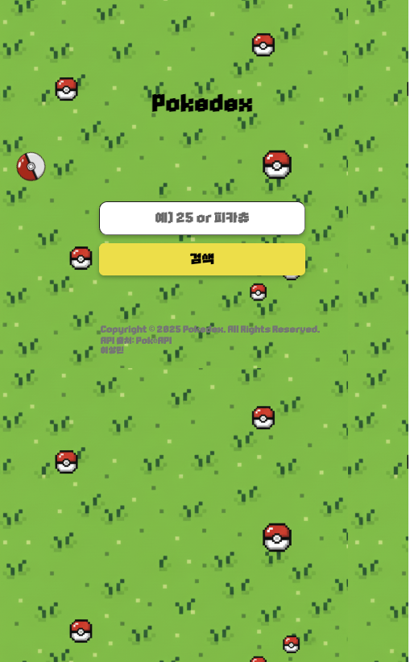
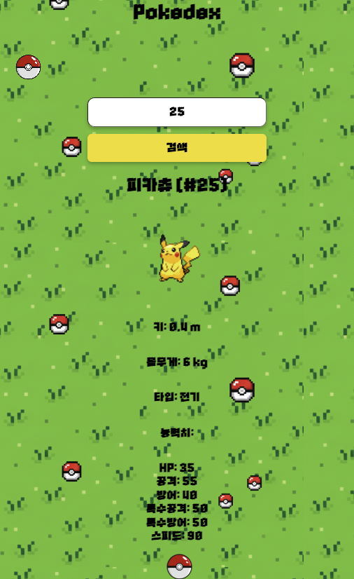
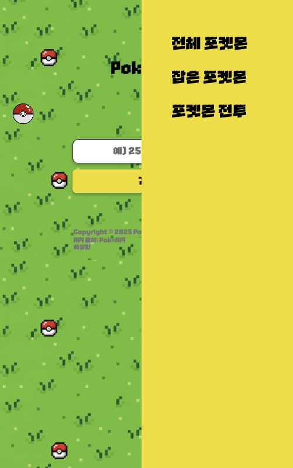
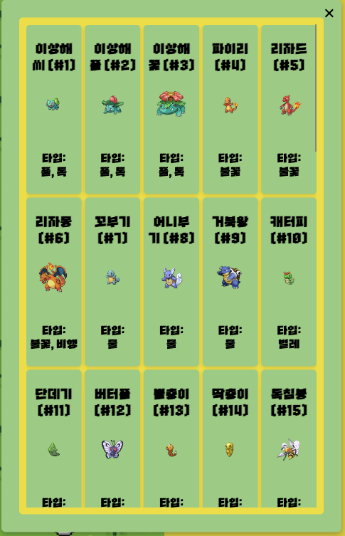
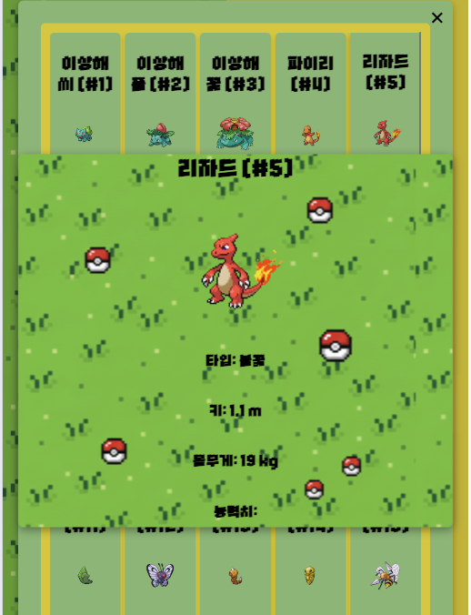
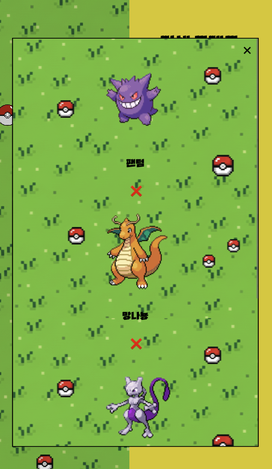
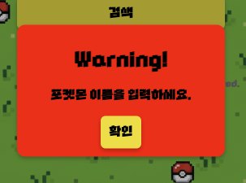
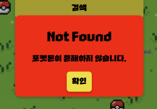

# 📖 Pokedex

포켓몬 정보를 검색하고 확인할 수 있는 웹 애플리케이션입니다.  
**PokeAPI**를 활용하여 실시간으로 포켓몬 데이터를 불러오고,  
사용자 친화적인 UI/UX로 포켓몬 검색 및 상세 조회, 저장등 다양한 기능을 제공합니다.  

🔗 **배포 주소:** [Pokedex 바로가기](https://qwezxc3810.github.io/Pokedex/)  

🔗 **GitHub Repo:** [Repository 링크](https://github.com/qwezxc3810/Pokedex)

🔗 **API 주소:** [PokeAPI 바로가기](https://pokeapi.co/) 

---

## 💡 프로젝트 소개
- 본 프로젝트는 **API 연동, 데이터 파싱, 비동기 처리, UI/UX 구현 능력**을 보여주기 위해 제작했습니다.  
- 단순한 데이터 출력이 아니라, **사용자가 직관적으로 정보를 탐색할 수 있는 인터페이스**를 구현했습니다.  

---

## 📂 파일 구조
```
.
├── assets
│   ├── fonts
│   │   └── Cafe24PROUP
│   │       ├── Cafe24PROUP.otf
│   │       ├── Cafe24PROUP.ttf
│   │       ├── License-PRO UP.pdf
│   │       └── webfont
│   │           ├── Cafe24PROUP.woff
│   │           └── Cafe24PROUP.woff2
│   └── Images
│       ├── allpokemon-back.png
│       ├── pokemonball.png
│       └── 포켓몬 전투 화면.jpeg
├── index.html
├── js
│   ├── app.js
│   ├── koeranpokemon.json
│   └── modules
│       ├── allpokemon.js
│       ├── mini-alert.js
│       ├── mydex-modal.js
│       └── mydex.js
├── README-img
│   ├── page1.png
│   ├── page2.png
│   ├── page3.png
│   ├── page4.png
│   ├── page5.png
│   ├── page6.png
│   ├── page7.png
│   └── page8.png
├── README.md
└── styles
    ├── animations.css
    ├── base
    │   ├── font.css
    │   ├── global.css
    │   ├── reset.css
    │   └── variables.css
    ├── components
    │   ├── alert.css
    │   └── modal.css
    └── layout
        ├── footer.css
        ├── header.css
        └── main.css
```
---
## 📸 미리보기









---


## ✨ 주요 기능 (Features)
### 1. 검색 기능
- 🔍 포켓몬 이름 및 번호 검색 (🚧 추후 한국어 검색 기능 추가 예정) 
- 📋 포켓몬 기본 정보(ID, 이름, 키, 몸무게, 타입, 능력치) 조회  
- 💬 species API 활용, 이름/타입/능력치 한국어 변환 표시
- 📝 검색 결과 상세 카드 렌더링

### 2. 전체 포켓몬 보기 & 무한 스크롤
- 🎨 전체 포켓몬 리스트 fetch
- ⚡️ 배치 단위로 병렬 fetch (50개씩)
- ⬇️ 무한 스크롤 적용
- 📄 클릭 시 상세 모달 표시

### 3. 마이덱스 (포켓몬 도감 - 잡은 포켓몬)
- ⭐ 나만의 도감 추가하여 좋아하는 포켓몬을 저장 하는 시스템 
- 👷 로컬스토리지 활용
- ➕ 추가/삭제 버튼 이벤트 위임
- 🔧 모달 내 카드 렌더링

### 4. 상세 모달 & UI/UX
- 📱 반응형 UI 지원
- 🚸 포켓몬을 저장할때 몬스터볼이 움직이며 만화와 비슷한 장면 구현 (사용자 경험 개선)
- 💚 모달 접근성 고려 (ESC 키, 포커스 이동, 백드롭 클릭)
- 🚨 커스텀 알림 (`MiniAlert`) → 자동 닫기, 백드롭 옵션

## 💡 비동기 처리 & API
- 💥 REST API: PokéAPI
- 💥 `fetch` + `async/await` 사용
- 💥 `Promise.all`로 병렬 요청
- 💥 캐싱 객체로 불필요한 요청 방지

## 📝 개선 사항
- 🚧 상성 및 능력치를 이용한 간단한 전투 시스템 (추가 예정)
- 🚧 능력치 시각화 (추가 예정)
- 🚧 fetch 함수 중복 제거 → utils.js 분리
- 🚧 모달 ESC 키 이벤트 통합 관리
- 🚧 무한 스크롤 IntersectionObserver 적용
- 🚧 innerHTML 반복 사용 대신 DocumentFragment 활용
---

## 🛠 기술 스택 (Tech Stack)

- **Frontend:** HTML5, CSS3, JavaScript (Vanilla)  
- **API:** [PokeAPI](https://pokeapi.co/)  
- **Deployment:** GitHub Pages
- **웹 접근성 고려:** (ARIA, sr-only, 모달 포커스 관리)

---

## 🥅 프로젝트 진행 중 문제점과 해결 방법

- ### "Api를 제대로 가져왔는지?"
- **문제:** PokéAPI에는 포켓몬 목록, 개별 포켓몬 정보, species 정보 등 여러 엔드포인트가 있어 정확히 어떤 데이터를 어떻게 가져와야 할지 헷갈림.
- **해결 방법:**
```
const res = await fetch(`https://pokeapi.co/api/v2/pokemon/${name}`);
const pokemon = await res.json();
const speciesRes = await fetch(pokemon.species.url);
const species = await speciesRes.json();
```
- **왜 이렇게 했는지:** PokéAPI는 한 엔드포인트에서 모든 정보를 제공하지 않기 때문에 필요한 데이터를 정확히 가져오기 위해 두 번 fetch가 필요함.


- ### 무한 스크롤
- **문제:** 전체 포켓몬(1025개)을 한 번에 렌더링하면 브라우저 성능 저하
- **해결 방법:**
```
const limit = 50;
let offset = 0;
const batch = allPokemonList.slice(offset, offset + limit);
offset += limit;
```
- **왜 이렇게 했는지:** 화면에 필요한 데이터만 점진적으로 렌더링하여 성능과 UX 최적화

- ### 비동기 방식
- **문제:** 여러 fetch 호출을 순차적으로 처리하면 느려짐. 특히 전체 포켓몬 무한 스크롤에서 병렬 처리 필요
- **해결 방법:**
```
const details = await Promise.all(
  batch.map(async (p) => {
    const resDetail = await fetch(p.url);
    return await resDetail.json();
  })
);
```
- **왜 이렇게 했는지:** Promise.all을 사용하면 병렬로 fetch → 속도 개선, 전체 로딩 시간을 단축

- ### 한글화
- **문제:** PokéAPI는 기본 영어 이름, 타입, 능력치 이름 제공
- **해결 방법:**
```
async function fetchKoName(url, cache) {
  if (cache[url]) return cache[url];
  const res = await fetch(url);
  const data = await res.json();
  const koName = data.names.find(n => n.language.name === "ko")?.name;
  cache[url] = koName || data.name;
  return cache[url];
}
```
- **왜 이렇게 했는지:** 한국어 이름을 별도로 species API에서 가져와 사용자 친화적인 UI 제공

- ### 캐싱
- **문제:** 동일한 포켓몬 타입/능력치/종 정보 fetch를 반복하면 속도 저하
- **해결 방법:**
```
const typeCache = {};
const statCache = {};
const speciesCache = {};
```
- **왜 이렇게 했는지:** API 호출 최소화 → 성능 개선 + 불필요한 네트워크 요청 방지

- ### 통합/모듈 처리
- **문제:** 검색, 전체보기, 마이덱스, 모달 등 기능이 많아 app.js에 전부 넣으면 관리 어려움
- **해결 방법:**
```
├─ app.js           // 메인 이벤트, 검색, 모달 관리
├─ modules/
│  ├─ allpokemon.js  // 전체 포켓몬 무한 스크롤
│  ├─ mydex.js       // 마이덱스 로컬스토리지
│  ├─ mydex-modal.js // 마이덱스 모달 렌더링
│  └─ mini-alert.js  // 커스텀 알림
```
- **왜 이렇게 했는지:** 모듈화 → 코드 가독성, 유지보수 용이, 재사용성 증가

---

## 🚀 설치 및 실행 방법 (Installation)

```bash
# 저장소 클론
git clone https://github.com/qwezxc3810/Pokedex.git

# 디렉토리 이동
cd Pokedex

# index.html을 브라우저에서 실행
```


## 📜 라이선스
이 프로젝트는 MIT 라이선스를 따릅니다.
